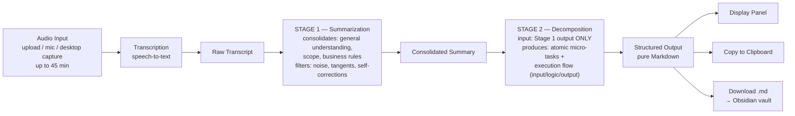
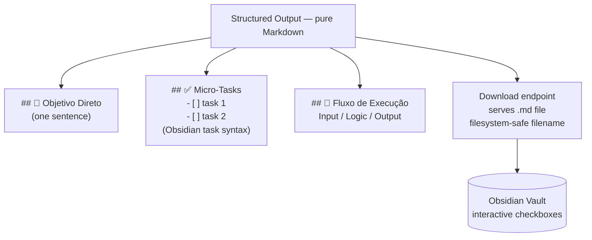

# Feature Specification: FocusTask Agent

**Feature Branch**: `001-focustask-agent`

**Created**: 2026-06-20

**Last Updated**: 2026-07-02

**Status**: Draft

**Input**: User description: "FocusTask Agent — ADHD-friendly audio-to-task pipeline for Hugging Face Spaces portfolio project."

**Refinement 2026-07-02**: Two-stage analysis pipeline for long audio (up to 45 min) — Stage 1 summarization consolidates understanding/scope/business rules, Stage 2 decomposition produces atomic micro-tasks and the visual flow. Output is now pure Obsidian-compatible Markdown (`- [ ]` tasks) with direct `.md` file download.

## User Scenarios & Testing *(mandatory)*

### User Story 1 - Audio Upload and Task Extraction (Priority: P1)

A user (manager, team lead, or knowledge worker with ADHD) has an audio recording describing a task or set of work instructions. They upload the audio file to the interface. The system transcribes it, filters out tangents and verbal noise, and delivers a clean structured task breakdown in three sections.

**Why this priority**: This is the core value proposition. The entire product exists to do this one thing. Nothing else is viable without it working end-to-end.

**Independent Test**: Upload a sample audio file containing tangents (e.g., "ah, vê lá com o fulano... não, espera, faz aquilo antes"). Verify that output panel displays all 3 sections and that noise phrases are absent from the output.

**Acceptance Scenarios**:

1. **Given** a user has a valid audio file, **When** they upload it and submit, **Then** the system processes it and displays the structured output panel with all 3 sections
2. **Given** the audio contains verbal noise and tangents, **When** the output is generated, **Then** filler phrases, self-corrections, and off-topic content do not appear in any output section
3. **Given** processing completes, **When** user views the output, **Then** the raw transcript is also visible for reference alongside the structured output

---

### User Story 2 - Live Microphone Recording (Priority: P2)

A user wants to capture a task on the fly without pre-recording. They click a record button, speak their instruction, stop recording, and immediately get structured output — no file management required.

**Why this priority**: Reduces friction for spontaneous task capture, which is critical for ADHD users who need to externalize thoughts immediately before they disappear.

**Independent Test**: Click record, speak a work instruction, stop recording. Verify the system processes it identically to a file upload and shows structured output.

**Acceptance Scenarios**:

1. **Given** user clicks the record button, **When** they finish speaking and stop, **Then** the recording is automatically submitted for processing
2. **Given** a live recording is submitted, **When** processing completes, **Then** output is identical in structure to a file-uploaded result

---

### User Story 3 - Structured Output Review (Priority: P2)

User reads the three-section output — direct objective, micro-task checklist, and execution flow — and immediately understands what they need to do without re-reading the original audio.

**Why this priority**: The structured output IS the product. If the presentation is cluttered, too long, or unclear, the ADHD-friendly goal fails entirely.

**Independent Test**: Given a known audio input, verify output sections are present, objective is one sentence, checklist has specific steps, and flow shows input/logic/output.

**Acceptance Scenarios**:

1. **Given** processing completes, **When** user reads the Direct Objective section, **Then** it contains exactly one sentence stating what must be delivered
2. **Given** processing completes, **When** user reads the Micro-Tasks Checklist, **Then** each item is a specific, independently actionable step (not a vague category)
3. **Given** processing completes, **When** user reads the Execution Flow section, **Then** it clearly labels what enters (input), what happens (logic), and what comes out (expected result)

---

### User Story 4 - Copy Structured Output (Priority: P3)

User copies the structured task breakdown to use in another tool (task manager, team chat, notes app).

**Why this priority**: The output needs to travel. Users won't manually retype; if they can't copy it easily, the workflow breaks.

**Independent Test**: Click copy button, paste into a text editor, verify all 3 sections appear with formatting intact.

**Acceptance Scenarios**:

1. **Given** structured output is displayed, **When** user clicks copy, **Then** formatted text is placed in clipboard with section labels and checklist items preserved
2. **Given** user pastes the copied content, **Then** checklist items appear as a list, not collapsed into a single block of text

---

---

### User Story 5 - Desktop Meeting Capture (Priority: P3)

During a live meeting on Meet, Discord, or any video call tool, the user runs a local Python script. They press F9 to start capturing system audio (other participants) and microphone audio (themselves) simultaneously. When the meeting ends or a task is discussed, they press F9 again to stop. The script mixes both channels, sends the recording to the FocusTask Agent API, and the structured task breakdown appears in the browser or is copied to clipboard automatically — no manual upload needed.

**Why this priority**: Closes the loop for the most common real-world scenario (tasks assigned in meetings) without requiring the user to remember to record separately. P3 because it requires a companion local script and is a separate distribution artifact from the web app.

**Independent Test**: Run the desktop script, press F9, play a YouTube video while speaking into the mic, press F9 again. Verify a .wav file is created with both audio channels mixed, the API call succeeds, and the result opens in the browser.

**Acceptance Scenarios**:

1. **Given** the desktop script is running, **When** user presses F9, **Then** recording starts capturing both system audio and microphone simultaneously with a visual/terminal indicator
2. **Given** recording is active, **When** user presses F9 again, **Then** recording stops, channels are mixed into a single .wav file, and it is automatically sent to the FocusTask Agent API
3. **Given** the API processes the mixed audio, **When** response arrives, **Then** the structured Markdown output is either opened in the default browser or copied to clipboard (configurable)
4. **Given** the API call fails or times out, **When** the error occurs, **Then** the local .wav file is preserved and the user is notified via terminal with the file path so they can retry manually

---

### User Story 6 - Long Audio Deep Processing (Priority: P2)

A user has a long recording — a full 45-minute meeting or an extended briefing. Instead of losing details in a single analysis pass, the system first builds a consolidated understanding of the recording (overall goal, scope, business rules mentioned), and only then decomposes that understanding into atomic micro-tasks and the execution flow. The user receives an output that stays faithful to details mentioned early in the audio, even for very long recordings.

**Why this priority**: Single-pass analysis loses context on long inputs — details from minute 5 disappear when the model produces the final output at minute 40's content. The two-stage pipeline (summarize → decompose) is what makes long recordings viable, and long meetings are the highest-value real-world source of tasks.

**Independent Test**: Process a 30+ minute recording where a business rule is stated only in the first 5 minutes. Verify the final checklist and execution flow reflect that early rule, and that an intermediate consolidated summary was produced between transcription and decomposition.

**Acceptance Scenarios**:

1. **Given** an audio recording of up to 45 minutes, **When** the user submits it, **Then** the system completes processing and delivers the full structured output without truncation or failure
2. **Given** the transcript is ready, **When** analysis begins, **Then** the system first produces a consolidated summary capturing general understanding, scope, and business rules of the recording
3. **Given** the consolidated summary exists, **When** decomposition runs, **Then** micro-tasks and the execution flow are derived strictly from the consolidated summary — not from a second pass over the raw transcript
4. **Given** a business rule or constraint is mentioned only once early in a long recording, **When** the final output is generated, **Then** that rule is reflected in the relevant micro-tasks or execution flow
5. **Given** the summarization stage succeeds but the decomposition stage fails, **When** the error is reported, **Then** the message identifies which stage failed

---

### User Story 7 - Obsidian Markdown Export (Priority: P2)

An Obsidian user finishes processing an audio and wants the structured breakdown inside their vault. The output is pure Markdown using the standard `- [ ]` task syntax, and a download button delivers a ready-to-use `.md` file. The user drops the file into their vault and immediately gets interactive checkboxes, headings, and a note that behaves like any other native Obsidian note.

**Why this priority**: The structured output must live where the user manages work. For note-driven ADHD workflows, Obsidian is the target destination; an output that requires reformatting before pasting into the vault breaks the "zero friction" promise.

**Independent Test**: Process any audio, click the download button, move the `.md` file into an Obsidian vault. Verify checklist items render as clickable checkboxes and all three sections appear with proper headings.

**Acceptance Scenarios**:

1. **Given** structured output is displayed, **When** the user inspects the underlying format, **Then** it is pure Markdown — headings for the three sections and `- [ ]` syntax for every checklist item, with no HTML or proprietary markup
2. **Given** structured output is ready, **When** the user clicks the download action, **Then** the browser downloads a `.md` file containing the complete structured output
3. **Given** the downloaded file is placed in an Obsidian vault, **When** it is opened, **Then** checklist items render as interactive checkboxes and section headings render correctly
4. **Given** a download is triggered, **When** the file is saved, **Then** the filename is derived from the task objective and date (filesystem-safe, no invalid characters)

---

### Edge Cases

- What happens when audio contains no actionable work content (e.g., casual chitchat, background noise only)?
- How does the system handle audio files longer than 45 minutes (reject upfront vs. truncate)?
- What if the summarization stage (Stage 1) drops a business rule that only appears once in the transcript?
- What if Stage 1 succeeds but Stage 2 (decomposition) fails or times out — is the consolidated summary still usable/visible?
- What if the consolidated summary itself is too long for the decomposition stage to consume?
- What if the task objective contains characters invalid in filenames when generating the downloadable `.md`?
- What if transcription produces garbled or nonsensical text?
- What if the user's microphone access is denied by the browser?
- What happens if the LLM processing step fails or times out?
- What if the audio is entirely in a language the system cannot transcribe?
- What if system audio capture is blocked by the OS (e.g., audio routed to Bluetooth device)?
- What if the mixed .wav file exceeds the API's size or duration limit?
- What happens if the user presses F9 to stop before any meaningful audio is captured?

## Data Flow *(mandatory)*

### End-to-End Pipeline (two-stage analysis)

**Key properties of the two-stage analysis**:

1. **Stage 1 (Summarization)** consumes the raw transcript and consolidates the general understanding, scope, and business rules of the recording. Noise filtering (fillers, tangents, self-corrections) happens here.
2. **Stage 2 (Decomposition)** consumes **only** the Stage 1 consolidated summary — never the raw transcript — and strictly breaks it into atomic micro-tasks and the visual execution flow (input / logic / output).
3. The two stages are **sequential analysis calls**, replacing the previous single-pass approach, to prevent context loss on long recordings.

### Output & Export Flow

## Requirements *(mandatory)*

### Functional Requirements

- **FR-001**: System MUST accept audio input via file upload supporting common formats (mp3, wav, ogg, m4a, webm)
- **FR-002**: System MUST accept audio input via live microphone recording directly in the interface
- **FR-003**: System MUST transcribe audio to raw text and display the raw transcript alongside the structured output
- **FR-004**: System MUST filter verbal noise, self-corrections, filler words, and off-topic tangents from the transcription during the summarization stage
- **FR-005**: System MUST extract a single direct objective sentence stating what must be delivered
- **FR-006**: System MUST generate a micro-tasks checklist where each item is a specific, independently actionable (atomic) step
- **FR-007**: System MUST generate an execution flow section as an ordered sequence of 3–6 stages, where the first stage states what enters (input/initial state), the last states the expected result (output), and intermediate stages describe the main transformations (logic)
- **FR-008**: System MUST present the three output sections in a visually distinct, scannable panel — not a wall of text
- **FR-009**: System MUST provide a one-click copy action for the complete structured output
- **FR-010**: System MUST show a processing indicator while transcription and analysis are running
- **FR-011**: System MUST display a clear, plain-language error message when any processing step fails
- **FR-012**: System MUST support audio in Portuguese (PT-BR) as the primary language, with English as secondary
- **FR-013**: The FocusTask Agent API endpoint MUST accept audio file uploads via HTTP POST from external clients (not just the Gradio web UI) with no authentication required
- **FR-014**: The desktop script MUST capture system audio output (loopback) and microphone input simultaneously on the local machine
- **FR-015**: The desktop script MUST mix both captured audio channels into a single audio file before sending
- **FR-016**: The desktop script MUST use a configurable hotkey (default: F9) to toggle recording start/stop without requiring mouse interaction
- **FR-017**: The desktop script MUST send the mixed audio file to the FocusTask Agent API and receive the structured response (JSON including the rendered Markdown and the `.md` download link)
- **FR-018**: The desktop script MUST deliver the structured output by either opening it in the default browser or copying it to the system clipboard (user-configurable)
- **FR-019**: The desktop script MUST preserve the local .wav file on API failure and inform the user via terminal output

#### Two-Stage Analysis Pipeline

- **FR-020**: System MUST process every transcript through two sequential analysis stages: Stage 1 (summarization) followed by Stage 2 (decomposition) — never a single-pass request for the final structured output
- **FR-021**: Stage 1 MUST produce a consolidated summary from the raw transcript capturing: general understanding of the recording, scope of the work, and any business rules or constraints mentioned
- **FR-022**: Stage 2 MUST consume only the Stage 1 consolidated summary (not the raw transcript) and strictly decompose it into the atomic micro-tasks checklist and the execution flow (input / logic / output)
- **FR-023**: System MUST support audio recordings of up to 45 minutes in duration through this pipeline. For web clients, long-audio processing MUST be asynchronous — the upload returns a job identifier immediately and the client polls job status — so no HTTP request must stay open for the full processing time; recordings over 45 minutes are rejected upfront (before transcription) with a clear message
- **FR-024**: When either stage fails, the error message MUST identify which stage failed (summarization vs. decomposition)

#### Obsidian-Compatible Output & Export

- **FR-025**: The structured output MUST be pure Markdown — standard headings for the three sections and the `- [ ]` task syntax for every checklist item, with no HTML or proprietary markup
- **FR-026**: System MUST expose a download action (endpoint + UI button) that delivers the complete structured output as a `.md` file ready to be dropped into an Obsidian vault
- **FR-027**: The downloaded filename MUST be filesystem-safe and derived from the task objective and processing date (invalid filename characters removed or replaced)

### Key Entities

- **AudioInput**: User-provided audio content (file, live browser recording, or mixed desktop capture), format, and approximate duration (up to 45 minutes)
- **Transcript**: Raw text output from speech-to-text, with detected language
- **ConsolidatedSummary**: Intermediate output of Stage 1 — general understanding, scope, and business rules extracted from the transcript; sole input to Stage 2
- **TaskOutput**: Composed of DirectObjective (single sentence), MicroTaskChecklist (ordered list of atomic steps in `- [ ]` Markdown syntax), and ExecutionFlow (input / logic / output triple); serialized as pure Markdown
- **MarkdownExport**: Downloadable `.md` document containing the full TaskOutput, with filesystem-safe filename (objective slug + date)
- **DesktopCapture**: Local recording session with system audio channel, microphone channel, mixed output file path, and recording duration

## Success Criteria *(mandatory)*

### Measurable Outcomes

- **SC-001**: Users complete the full audio-to-structured-output flow in under 60 seconds for a 1-minute audio recording
- **SC-002**: The Direct Objective section contains a single sentence of 30 words or fewer in 90% of processed inputs
- **SC-003**: The Micro-Tasks Checklist contains between 3 and 10 items for a typical 30–90 second work instruction recording
- **SC-004**: Verbal noise phrases ("vê lá", "espera", "ah", "não, volta lá") are absent from all output sections in 95% of cases where they appear in the transcript
- **SC-005**: A first-time user with no instructions can complete a full session (upload → output) without guidance, on first attempt
- **SC-006**: System processes audio files up to 45 minutes in length without failure or truncation of the structured output
- **SC-007**: Desktop script delivers the structured output to browser or clipboard within 90 seconds of pressing F9 to stop recording (for a 2-minute meeting segment)
- **SC-008**: Desktop script runs on Windows without requiring admin privileges or paid software
- **SC-009**: For recordings longer than 10 minutes, business rules mentioned only in the first quarter of the audio appear in the final output (checklist or execution flow) in 90% of test cases
- **SC-010**: A downloaded `.md` file placed in an Obsidian vault renders all checklist items as interactive checkboxes and all three section headings correctly, with zero manual reformatting
- **SC-011**: For 45-minute recordings, the Direct Objective still meets SC-002 (one sentence, ≤30 words), the checklist stays within the 3–10 item limit, and noise absence (SC-004) still holds — the two-stage pipeline compresses long inputs without inflating the output

## Assumptions

- Primary audience is PT-BR speaking knowledge workers (managers, developers, team leads) who have or suspect ADHD
- Users have access to a modern desktop browser; mobile is nice-to-have but not required for v1
- Audio recordings range from 30 seconds (quick capture) up to 45 minutes (full meetings); short clips remain the most common case
- The two sequential analysis calls add acceptable latency: users accept longer processing time for long recordings in exchange for output fidelity
- Recordings longer than 45 minutes are rejected upfront with a clear message (not silently truncated); duration is measured from audio metadata before transcription starts
- Web processing of long audio is asynchronous (job id + status polling); a synchronous inline response is only viable for short clips
- The intermediate consolidated summary is an internal pipeline artifact; exposing it in the UI is optional (useful for debugging/transparency, not required for v1)
- Obsidian vault import is manual (user drops the downloaded `.md` into the vault); no direct vault/plugin integration in v1
- The `- [ ]` Markdown task syntax is the compatibility contract — output also renders correctly in any standard Markdown tool (GitHub, VS Code, Notion import)
- Each session is stateless — no user accounts, no history, no persistence in v1
- Deployment target is Hugging Face Spaces free tier; expected load is low (portfolio demo traffic)
- Data privacy and LGPD/GDPR compliance are out of scope for v1 (no data is stored)
- The checklist output language matches the input audio language (PT-BR in → PT-BR out)
- Desktop script targets Windows as primary OS (user's platform); macOS/Linux are stretch goals
- System audio loopback capture requires a virtual audio device or OS-level loopback support (e.g., Windows WASAPI loopback) — no paid virtual cable software required
- The HF Spaces API endpoint is publicly accessible (no auth token required for portfolio demo)
- Desktop script is a standalone Python script, not a packaged executable, for v1
- The HF Spaces API endpoint is unauthenticated (public); no API token or secret is needed in the desktop script

## Clarifications

### Session 2026-06-20

- Q: Does the HF Spaces API endpoint require authentication for desktop client POSTs? → A: No auth — public endpoint, acceptable for portfolio demo with no data persistence

### Session 2026-07-02 (architecture refinement)

- Q: How to avoid context loss on long recordings (up to 45 min)? → A: Two sequential analysis stages — Stage 1 consolidates understanding/scope/business rules from the raw transcript; Stage 2 decomposes strictly from the Stage 1 output into atomic micro-tasks and the execution flow. Single-pass output requests are no longer allowed.
- Q: What is the target format/destination for the structured output? → A: Pure Markdown optimized for Obsidian — `- [ ]` task syntax, standard headings — with a download endpoint/button delivering a ready `.md` file for the user's vault.
